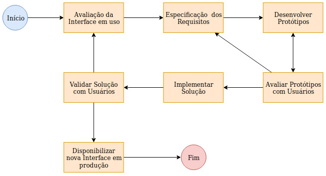

# IHC - Modelo de Processo de Desing
 
Breve descrição:
<h4>
Este modelo de processo de design possui 7 etapas, ele foi baseado no modelo simples, estrela e de engenharia de usabilidade de Nielsen. Este modelo foca na avaliação prática do usuário onde é sempre realizado algum teste diretamente com os usuários para validar o trabalho realizado até aquele ponto.
</h4>

O diagrama é este:
 

<h5>Ele é composto pelas seguintes atividades:</h5>
1 - Avaliação da Interface em uso: Aqui deve-se avaliar a forma com que o usuário interage com a interface. É importante observar, durante esta esta etapa, quais os pontos de reclamação do usuário, quais as sugestões que ele dá, como ele se comporta ao interagir com a interface.
 
2 - Especificação de Requisitos: Nesta etapa serão levantados e especificados todos os requisitos aos quais a interface deve atender, caso este processo esteja sendo executado pela segunda (ou outras vezes) sem a re-avaliação da interface em uso então os requisitos propostos devem ser analisados e modificados de forma a atender as necessidades dos usuários.
 
3 - Desenvolver Protótipos: Esta etapa é onde serão desenvolvidos os protótipos que atendam aos requisitos levantados, aqui não é necessário o desenvolvimento de rabiscoframes e wireframes (embora seja muito recomendado) porém é obrigatório o desenvolvimento de protótipos dinâmicos (protótipos que sejam capazes de suportar alguma interação com o usuário como, por exemplo, navegabilidade de telas).
 
4 - Avaliar Protótipos com Usuários: O objetivo desta etapa é certificar-se que todo o trabalho desenvolvido até aqui esteja de acordo com as necessidades do usuário. Deve-se reunir um ou vários usuários (mais recomendado) e colocá-los para interagir com o protótipo gerado na atividade 3 (Desenvolver Protótipos).
 
5 - Implementar Solução: Aqui é onde a solução será realmente implementada seguindo o protótipo gerado na atividade 3 (Desenvolver Protótipos) e o feedback gerado pelos usuários na atividade 4 (Avaliar Protótipos com Usuários) visando atender todos os requisitos gerados na atividade 2 (Especificação de Requisitos).
 
6 - Validar Solução com Usuários: Novamente, o objetivo aqui é certificar-se que todo o trabalho desenvolvido até aqui atenda ao requisitos do usuário. Novamente deve-se reunir um ou uCm grupo de usuários (mais recomendado) e coloca-los para interagir com a solução implementada e recuperar seu feedback (não é obrigatório que sejam usuários diferentes porém é recomendado).
 
7 - Disponibilizar nova Interface em Produção: Ao alcançar esta atividade a interface já estará desenvolvida e validada pelos usuários que realmente utilizam a interface logo já é possível colocá la em produção para que todos os usuários a utilizem.

 
 

<h5>Ciclo do Processo de Design</h5>
O ciclo de execução deste processo de design inicia-se avaliando uma interface com usuários reais, com base nas informações adquiridas é gerado um documento de requisitos aos quais a nova interface deve atender.
 
Com base neste documento de requisitos deve-se implementar um protótipo dinâmico, este protótipo dinâmico é utilizado na próxima atividade (Avaliar protótipo) para verificação se ele é capaz de atender as necessidades do usuário, em caso negativo deve-se analisar o feedback do usuário para decidir entre alterar o documento de requisitos ou desenvolver novos protótipos. 
 
Caso o protótipo seja aceito pelos usuário então a solução é finalmente implementada visando alcançar todos os requisitos especificados na ação 2 (Especificação de Requisitos). Esta solução é então testada com os usuários, se for válida então entra em um estágio de espera onde ficará em uma fila esperando para entrar produção, caso seja negada então voltasse a etapa de observação das interações da interface com os usuários.

